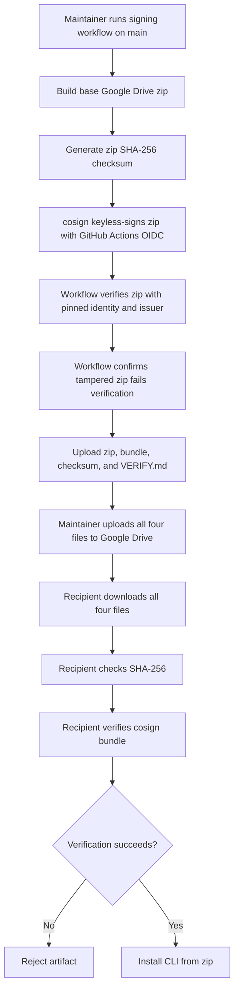

# Google Drive with cosign Recipe

This recipe distributes the Google Drive zip with Sigstore cosign verification material alongside it.

Use this pattern when the CLI must be delivered through a Google Drive share link, but recipients also need to verify artifact authenticity and integrity before installing.

The unsigned Google Drive recipe remains available at `recipes/google-drive/`. This recipe adds a signed distribution set without changing that base recipe.

## Distribution Set

The signed Google Drive distribution set is:

```text
codenote-hello-<version>.zip
codenote-hello-<version>.zip.bundle
codenote-hello-<version>.zip.sha256
VERIFY.md
```

The zip itself still contains the package tarball and install guide from the base Google Drive recipe:

```text
codenote-hello-<version>.zip
├── codenote-net-hello-cli-<version>.tgz
└── INSTALL.md
```

`VERIFY.md` is published alongside the zip instead of inside it, because changing the zip after signing would invalidate the signature.

## Build and Sign

Run the signing workflow from `main`:

```text
.github/workflows/sign-hello-cli-artifacts.yml
```

The workflow:

1. Builds the base Google Drive zip with `recipes/google-drive/build-distribution-zip.sh`.
2. Signs the zip with `cosign sign-blob --bundle` using GitHub Actions OIDC.
3. Generates `codenote-hello-<version>.zip.sha256`.
4. Verifies the untouched zip with the pinned GitHub Actions identity.
5. Modifies a copy of the zip and confirms verification fails.
6. Uploads the signed distribution set as a workflow artifact.

The workflow fails before signing if it is dispatched from any ref other than `refs/heads/main`.

## Upload to Google Drive

Download the `signed-hello-cli-artifacts` workflow artifact.

Upload these files to Google Drive together:

```text
codenote-hello-<version>.zip
codenote-hello-<version>.zip.bundle
codenote-hello-<version>.zip.sha256
VERIFY.md
```

Share all four files with the same audience. Do not publish the zip without its `.bundle`, `.sha256`, and `VERIFY.md` files when using this signed recipe.

## Consumer Verification

Recipients should download all four files into one directory, then follow `VERIFY.md`.

For convenience, the core verification commands are:

```sh
shasum -a 256 -c codenote-hello-<version>.zip.sha256

cosign verify-blob \
  --bundle codenote-hello-<version>.zip.bundle \
  --certificate-identity "https://github.com/codenote-net/cli-distribution-recipes/.github/workflows/sign-hello-cli-artifacts.yml@refs/heads/main" \
  --certificate-oidc-issuer "https://token.actions.githubusercontent.com" \
  codenote-hello-<version>.zip
```

Install only after both commands succeed:

```sh
unzip codenote-hello-<version>.zip -d codenote-hello
cd codenote-hello
cat INSTALL.md
npm install -g ./*.tgz
codenote-hello
```

Expected output:

```text
Ohayou gozaimasu, Konnichiwa, Konbanwa!
```

## Operations Flow



## Limitations

- This recipe still uses Google Drive as the transport. Google Drive sharing controls decide who can download the files.
- Verification requires recipients to install cosign unless they use only the weaker checksum fallback.
- The signature proves artifact origin and integrity for the signed bytes. It does not prove full build system integrity.
