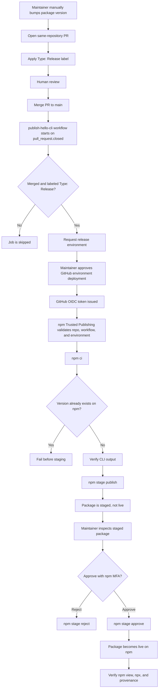

# npmjs Public Registry Recipe

This recipe publishes `@codenote-net/hello-cli` to the public npmjs.com registry from GitHub Actions using npm Trusted Publishing.

The implemented release model is PR-merge based and staged by default. GitHub repository write access alone must not be enough to push a live package to npm. CI can only stage a package; live promotion is a separate maintainer action that requires npm MFA.

Trusted Publishing uses GitHub Actions OIDC instead of a long-lived `NPM_TOKEN`. For a public repository and public package, npm also generates provenance automatically when the package is published through Trusted Publishing.

## Published Result

After the staged package is approved and promoted, users can run:

```sh
npx @codenote-net/hello-cli
```

Expected output:

```text
Ohayou gozaimasu, Konnichiwa, Konbanwa!
```

## Prerequisites

- The package name `@codenote-net/hello-cli` exists on npmjs.com or is available for first publish.
- `packages/hello-cli/package.json` has `publishConfig.access: public`.
- The GitHub workflow file exists at `.github/workflows/publish-hello-cli.yml`.
- The GitHub repository is public so npm can attach provenance.
- The release workflow runs on a GitHub-hosted runner.
- Node.js 22.14 or newer and npm 11.15.0 or newer are used in the publish job.
- Release PRs are opened from same-repository branches, not forks, so GitHub Actions can receive `id-token: write`.

## One-Time npm Setup

On npmjs.com, open the package settings for `@codenote-net/hello-cli`.

If this is the first publish and the package settings page does not exist yet, use your npm organization's current first-package setup flow without adding an npm publish token to GitHub repository or organization secrets. Future publishes for this recipe should go through Trusted Publishing only.

Configure Trusted Publishing:

```text
Provider: GitHub Actions
Organization or user: codenote-net
Repository: cli-distribution-recipes
Workflow filename: publish-hello-cli.yml
Environment name: release
Allowed actions: npm stage publish
```

Then open Settings -> Publishing access and select:

```text
Require two-factor authentication and disallow tokens
```

This keeps long-lived npm publish tokens out of the repository and organization secrets. There should be no `NPM_TOKEN` secret for this publish path.

Do not grant `npm publish` to this Trusted Publisher. This recipe is intentionally stage-only so a workflow change cannot use OIDC to push a live package without the separate npm staged-package approval step.

## One-Time GitHub Setup

Create a GitHub Deployment Environment named:

```text
release
```

Configure it with protection rules:

- Required reviewers: at least one maintainer.
- Prevent self-review: disabled for single-maintainer operation.
- Wait timer: disabled unless the repository intentionally wants a delay before staging.
- Allow administrators to bypass configured protection rules: disabled.
- Deployment branches and tags: allow only `refs/pull/*/merge`.
- Environment name: exactly `release`.

The environment name must match both the workflow and the npm Trusted Publisher configuration.

GitHub evaluates Environment branch protection rules for `pull_request` events against the executing pull request merge ref, `refs/pull/<number>/merge`. The `refs/pull/*/merge` restriction allows the PR-merge release path while blocking direct pushes, feature branches, and manual dispatches from accessing the `release` environment.

## Publish Workflow

The workflow lives at:

```text
.github/workflows/publish-hello-cli.yml
```

It uses:

- `pull_request.closed` on `main`
- job-level filtering for merged PRs with the `Type: Release` label
- `permissions: id-token: write, contents: read`
- `concurrency.group: publish-hello-cli`
- GitHub-hosted `ubuntu-latest`
- protected environment `release`
- Node.js 24 with npm 11.15.0 or newer
- pinned `actions/checkout` and `actions/setup-node` commit SHAs
- `package-manager-cache: false`
- `npm ci`
- a guard that fails if the package version already exists on npm
- CLI output verification before staging
- `npm stage publish`

The workflow does not run `npm publish`. CI only stages the package.

## Manual Release Flow

1. Create a same-repository branch.
2. Manually bump `packages/hello-cli/package.json` and `packages/hello-cli/package-lock.json`.
3. Open a PR to `main`.
4. Apply the `Type: Release` label by hand.
5. Review and merge the PR.
6. Approve the GitHub `release` Environment deployment.
7. Let CI run `npm stage publish`.
8. Inspect the staged package.
9. Approve the staged package with hardware MFA to promote it live.

Release PRs must come from same-repository branches. Fork-originated `pull_request` runs do not receive `id-token: write`, so OIDC Trusted Publishing will fail.

Automated release PR creation, such as a future `create-release-pr.yml`, is intentionally out of scope for this recipe and tracked separately.

## Operations Flow



## Why This Is Hardened

This model requires several independent boundaries before a live npm package exists:

- a maintainer creates a version-bump PR
- the PR receives source review
- the PR has the `Type: Release` label
- the PR is merged to `main`
- the deployment targets the protected `release` Environment through the PR merge ref
- a maintainer approves the environment deployment
- npm Trusted Publishing accepts the OIDC exchange
- npm receives only `npm stage publish`
- a maintainer separately approves the staged package with MFA

Modifying the workflow file alone cannot push a live package. A workflow modification must still pass PR review, merge through the protected PR path, receive environment approval, and then only stages the package. Live promotion remains outside CI and requires npm-side MFA.

This defends against workflow-modification plus OIDC-exfiltration attack classes by preventing repository write access from directly producing a live npm release.

## Staged Publishing Gate

After the workflow stages a package, inspect it from an authenticated maintainer machine:

```sh
npm stage list @codenote-net/hello-cli
npm stage view <id>
npm stage download <id>
```

Approve it with hardware MFA:

```sh
npm stage approve <id>
```

Reject it if anything is wrong:

```sh
npm stage reject <id>
```

You can also review and approve staged packages from the npmjs.com Staged Packages tab. Staged publishing works well for this single-package recipe, but per-package approval does not batch cleanly in larger monorepos.

## Verify

Before `npm stage approve`, the package is staged but not live. It is not installable with `npx` or `npm install -g` until promotion.

Inspect the staged package first:

```sh
npm stage list @codenote-net/hello-cli
npm stage view <id>
npm stage download <id>
```

After approving the staged package, verify the live package metadata:

```sh
npm view @codenote-net/hello-cli version
npm view @codenote-net/hello-cli dist
```

Verify install paths after live promotion:

```sh
npx @codenote-net/hello-cli
npm install -g @codenote-net/hello-cli
codenote-hello
```

Expected output:

```text
Ohayou gozaimasu, Konnichiwa, Konbanwa!
```

On npmjs.com, confirm that the package page shows provenance linked to:

```text
codenote-net/cli-distribution-recipes
.github/workflows/publish-hello-cli.yml
```

## Security Best Practices

- Prefer OIDC Trusted Publishing over stored npm tokens.
- Keep zero standing npm publish tokens for this package after Trusted Publishing is configured.
- Use `Require two-factor authentication and disallow tokens` for npm publishing access.
- Grant only `id-token: write` and `contents: read` to the release workflow.
- Pin third-party GitHub Actions to commit SHAs.
- Disable dependency caching in release jobs.
- Use protected GitHub Environments with required reviewers.
- Store operator credentials in a password manager that requires MFA before extraction.
- Use fine-grained, least-privilege GitHub PATs when local automation needs GitHub API access.

## Known Limitations

- The package is not available from npmjs.com until the npm-side Trusted Publisher, GitHub `release` Environment, and first release publish are completed.
- Provenance proves origin, not build-time integrity. A contaminated build can still receive a valid provenance statement.
- Provenance is generated only for public repositories and public packages.
- If publishing moves into a reusable workflow, npm Trusted Publishing must reference the caller workflow file.
- Trusted Publisher configurations created after May 20, 2026 must explicitly select at least one allowed action.
- Each package supports only one Trusted Publisher configuration.
- Self-hosted runners are not supported for npm Trusted Publishing.
- `npm stage approve` is a per-package approval flow and does not batch cleanly for monorepos.

## References

- npm Docs: Trusted publishing for npm packages: https://docs.npmjs.com/trusted-publishers/
- npm Docs: Generating provenance statements: https://docs.npmjs.com/generating-provenance-statements/
- npm Docs: Staged publishing for npm packages: https://docs.npmjs.com/staged-publishing/
- GitHub Changelog: Actions pull_request_target and environment branch protections changes: https://github.blog/changelog/2025-11-07-actions-pull_request_target-and-environment-branch-protections-changes/
- Hardening npm publishing: https://azu.github.io/slide/2026/hardening-npm-publishing/slide.html
