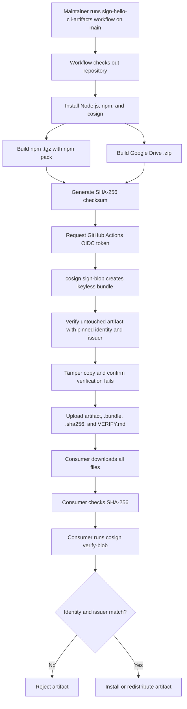

# Sigstore cosign Signing Recipe

This recipe keyless-signs the `@codenote-net/hello-cli` distribution artifacts with Sigstore cosign.

It signs both artifacts produced by this repository:

- the npm package tarball, `codenote-net-hello-cli-<version>.tgz`
- the Google Drive distribution zip, `codenote-hello-<version>.zip`

The workflow uses GitHub Actions OIDC. It does not use a long-lived signing key, and it does not require a repository secret.

## What the Workflow Produces

Run the workflow from `main`. The workflow fails before signing if it is dispatched from any other ref, because the documented verification identity is pinned to `refs/heads/main`.

```text
.github/workflows/sign-hello-cli-artifacts.yml
```

The uploaded workflow artifact contains:

```text
codenote-net-hello-cli-<version>.tgz
codenote-net-hello-cli-<version>.tgz.bundle
codenote-net-hello-cli-<version>.tgz.sha256
codenote-hello-<version>.zip
codenote-hello-<version>.zip.bundle
codenote-hello-<version>.zip.sha256
VERIFY.md
```

The `.bundle` files contain the cosign signature material needed by `cosign verify-blob`. The `.sha256` files are a minimal integrity fallback for environments that cannot install cosign. `VERIFY.md` is the consumer-facing verification guide for the signed Google Drive distribution set.

## Signing Flow

The workflow:

1. Checks out the repository.
2. Installs Node.js, npm, and cosign.
3. Builds the npm `.tgz` with `npm pack`.
4. Builds the Google Drive `.zip` from that same `.tgz`.
5. Writes one SHA-256 checksum file per artifact.
6. Runs `cosign sign-blob --bundle` for each artifact.
7. Verifies the untouched artifacts with the pinned GitHub Actions identity and issuer.
8. Modifies a copy of each artifact and confirms verification fails.
9. Uploads the artifacts, bundles, checksums, and Google Drive verification guide.

The workflow grants only:

```yaml
permissions:
  contents: read
  id-token: write
```

`id-token: write` is required for GitHub Actions keyless signing. No signing key or cosign password is stored in GitHub secrets.

## Operations Flow



## Local Smoke Test

Run this before opening a PR when you want local coverage for the parts that do not require GitHub Actions OIDC:

```sh
recipes/sigstore-cosign/local-smoke-test.sh
```

The script uses `mise` to run `aqua:sigstore/cosign@3.0.6`. It creates a temporary local key pair, builds the npm tarball and Google Drive zip in a temporary directory, signs both artifacts with `cosign sign-blob --bundle`, verifies both bundles, confirms tampered copies fail verification, and checks SHA-256 files.

This is only a local cosign smoke test. It does not prove the GitHub Actions keyless certificate identity, because that identity is issued only inside the signing workflow.

## Verify with cosign

Install cosign on the machine that will verify the artifact.

For the npm tarball:

```sh
cosign verify-blob \
  --bundle codenote-net-hello-cli-<version>.tgz.bundle \
  --certificate-identity "https://github.com/codenote-net/cli-distribution-recipes/.github/workflows/sign-hello-cli-artifacts.yml@refs/heads/main" \
  --certificate-oidc-issuer "https://token.actions.githubusercontent.com" \
  codenote-net-hello-cli-<version>.tgz
```

For the Google Drive zip:

```sh
cosign verify-blob \
  --bundle codenote-hello-<version>.zip.bundle \
  --certificate-identity "https://github.com/codenote-net/cli-distribution-recipes/.github/workflows/sign-hello-cli-artifacts.yml@refs/heads/main" \
  --certificate-oidc-issuer "https://token.actions.githubusercontent.com" \
  codenote-hello-<version>.zip
```

The verifier must pin both the certificate identity and OIDC issuer. Without those flags, verification can prove that an artifact was signed by some trusted identity, but not that it was signed by this repository workflow.

If the workflow file name, repository, or signing ref changes, update the workflow `CERTIFICATE_IDENTITY`, this README, and `recipes/google-drive-with-cosign/VERIFY.md` in the same change.

## Verify SHA-256 Checksums

Use checksums only as a fallback when cosign is unavailable:

```sh
shasum -a 256 -c codenote-net-hello-cli-<version>.tgz.sha256
shasum -a 256 -c codenote-hello-<version>.zip.sha256
```

Checksums detect accidental corruption and simple tampering only when the checksum file itself is obtained from a trusted location. They do not prove who produced the artifact. Prefer cosign verification when possible.

## Negative Tamper Test

Verification must fail after the artifact changes.

For the npm tarball:

```sh
cp codenote-net-hello-cli-<version>.tgz tampered.tgz
printf '\ntampered\n' >> tampered.tgz
cosign verify-blob \
  --bundle codenote-net-hello-cli-<version>.tgz.bundle \
  --certificate-identity "https://github.com/codenote-net/cli-distribution-recipes/.github/workflows/sign-hello-cli-artifacts.yml@refs/heads/main" \
  --certificate-oidc-issuer "https://token.actions.githubusercontent.com" \
  tampered.tgz
```

For the Google Drive zip:

```sh
cp codenote-hello-<version>.zip tampered.zip
printf '\ntampered\n' >> tampered.zip
cosign verify-blob \
  --bundle codenote-hello-<version>.zip.bundle \
  --certificate-identity "https://github.com/codenote-net/cli-distribution-recipes/.github/workflows/sign-hello-cli-artifacts.yml@refs/heads/main" \
  --certificate-oidc-issuer "https://token.actions.githubusercontent.com" \
  tampered.zip
```

Both commands should return a non-zero exit code.

## Human Verification Checklist

1. Download the artifact, its `.bundle`, and its `.sha256` file.
2. Run `shasum -a 256 -c <artifact>.sha256`.
3. Run `cosign verify-blob` with the pinned certificate identity and issuer.
4. Install or redistribute the artifact only if both checks succeed.

## Agent Verification Checklist

1. Refuse to install when the `.bundle` or `.sha256` file is missing.
2. Run checksum verification.
3. Run `cosign verify-blob`.
4. Require this exact certificate identity:

```text
https://github.com/codenote-net/cli-distribution-recipes/.github/workflows/sign-hello-cli-artifacts.yml@refs/heads/main
```

5. Require this exact OIDC issuer:

```text
https://token.actions.githubusercontent.com
```

6. Treat any verification error or identity mismatch as a hard failure.

## Keyless vs Key-Pair cosign

Keyless signing is recommended for this repository. GitHub Actions requests an OIDC token for the workflow run, Fulcio issues a short-lived signing certificate, and the signing event is recorded in Sigstore's transparency infrastructure.

Key-pair signing uses a persistent private key. It can work in offline or non-OIDC environments, but then the private key and its password must be generated, stored, rotated, and protected. This recipe intentionally avoids that key-management burden.

## Limitations

- The signing event is public.
- This verifies artifact origin and integrity, not the full build system integrity of every dependency and runner input.
- Production signing must run the workflow from `main` so the certificate identity matches the documented verification command.
